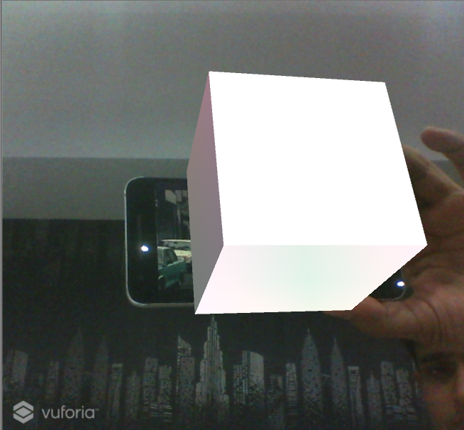

# Add Image Targets at Runtime in Vuforia
This project is intended to provide a workable example of how to set Vuforia ImageTargets at runtime. For more details read [here](https://library.vuforia.com/articles/Solution/How-To-Access-and-Modify-Targets-at-Run-Time.html).

To run this project don't forget to add your Vuforia lisence key and load the 'main' scene.

# Screenshot

